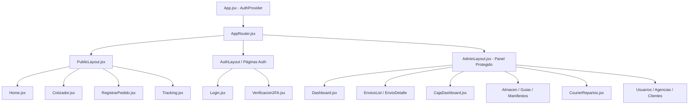

# Arquitectura y Especificación Técnica del Frontend CargaExpress

Este documento describe a profundidad la arquitectura, dependencias de software, decisiones de diseño, herramientas utilizadas durante la fase de desarrollo y directrices técnicas del cliente Frontend construido con React y Vite.

---

## 1. Ficha Técnica y Stack Tecnológico

La aplicación está construida como una **Single Page Application (SPA)** moderna, rápida y desacoplada del backend.

### 1.1. Dependencias Principales de Producción (`dependencies`)

| Dependencia | Versión | Propósito Arquitectónico |
| :--- | :--- | :--- |
| **`react`** | `^19.2.8` | Biblioteca principal para la creación de interfaces basada en componentes declarativos y renderizado reactivo. |
| **`react-dom`** | `^19.2.8` | Motor de montaje y reconciliación del Virtual DOM sobre el navegador web (`createRoot`). |
| **`react-router-dom`** | `^7.18.3` | Enrutamiento declarativo del lado del cliente, permitiendo navegación instantánea (SPA), anidamiento de rutas jerárquicas (*nested routes*) y layouts desacoplados con `<Outlet />`. |
| **`bootstrap`** | `^5.3.8` | Sistema de grillas responsivas (grid system de 12 columnas), utilidades de espaciado (`m-*`, `p-*`, `d-flex`) y componentes base de accesibilidad. |
| **`bootstrap-icons`** | `^1.13.1` | Librería principal de iconografía vectorial integrada en botones, estados de envíos, menús y formularios. |
| **`lucide-react`** | `^1.41.0` | Conjunto complementario de iconos SVG modernos y limpios para tableros analíticos y métricas operativas. |

### 1.2. Dependencias y Herramientas de Desarrollo (`devDependencies`)

| Herramienta | Versión | Rol en la Fase de Desarrollo |
| :--- | :--- | :--- |
| **`vite`** | `^8.2.2` | Entorno de ejecución y empaquetador ultrarrápido (*bundler*). Usa módulos nativos ES (ESM) para un arranque en milisegundos y Hot Module Replacement (HMR) instantáneo al editar código. |
| **`@vitejs/plugin-react`** | `^6.1.0` | Soporte oficial de Vite para la transformación JSX/TSX y optimización del ciclo de vida de React. |
| **`eslint`** + plugins | `^10.9.0` | Linter de análisis estático de código para garantizar buenas prácticas en componentes funcionales y reglas estrictas de React Hooks (`eslint-plugin-react-hooks`). |

---

## 2. Estructura del Proyecto (`src/`)

La estructura de carpetas sigue una separación clara por responsabilidades:

```text
CargaExpressFront/
├── docs/                      # Documentación técnica y guías de arquitectura
│   ├── arquitectura-frontend.md
│   └── guia-ejecucion-y-rutas.md
├── public/                    # Archivos estáticos servidos directamente
└── src/
    ├── assets/                # Logotipos, imágenes vectoriales y recursos visuales
    ├── components/            # Componentes reutilizables
    │   └── layout/            # Layouts estructurales (PublicLayout.jsx, AdminLayout.jsx)
    ├── context/               # Proveedores de estado global (AuthContext.jsx)
    ├── pages/                 # Vistas ordenadas por dominio funcional
    │   ├── public/            # Home, Cotizador, RegistrarPedido, PedidoExitoso, Tracking
    │   ├── auth/              # Login, Verificacion2FA
    │   └── admin/             # Módulos operativos administrativos:
    │       ├── dashboard/     # Resumen general y métricas operativas
    │       ├── envios/        # EnviosList.jsx, EnvioDetalle.jsx
    │       ├── agencias/      # AgenciasList.jsx
    │       ├── clientes/      # ClientesList.jsx
    │       ├── caja/          # CajaDashboard.jsx
    │       ├── almacen/       # AlmacenStock.jsx
    │       ├── guias/         # GuiasList.jsx
    │       ├── manifiestos/   # ManifiestosList.jsx
    │       ├── courier/       # CourierRepartos.jsx
    │       └── usuarios/      # UsuariosList.jsx
    ├── routes/                # Configuración central del enrutador (AppRouter.jsx)
    ├── App.jsx                # Componente raíz envuelto en AuthProvider
    ├── index.css              # Design tokens CSS, clases utilitarias y estilos globales
    └── main.jsx               # Punto de entrada de la aplicación (ReactDOM.createRoot)
```

---

## 3. Patrón Arquitectónico: Composición por Layouts

La aplicación implementa el patrón **Layouts Jerárquicos Anidados** mediante `react-router-dom`:



### 3.1. `PublicLayout.jsx` (Portal Público)
* Diseñado para clientes y visitantes corporativos.
* Incluye cabecera institucional (`navbar`) con enlaces de rastreo, cotización, contacto directo por WhatsApp y botón de acceso a trabajadores.
* Renderiza el contenido dinámico mediante el componente `<Outlet />`.
* Pie de página unificado con enlaces de cobertura y libro de reclamaciones.

### 3.2. `AdminLayout.jsx` (Plataforma Operativa Interna)
* Sidebar lateral con ancho corporativo estandarizado de `260px` (`--sidebar-width`).
* Menú agrupado por áreas de negocio: *Dashboard*, *Operaciones*, *Caja*, *Logística*, *Entregas*, *Configuración*.
* Indicador visual dinámico de ruta activa mediante `.nav-item a.active`.
* **Simulador de Roles Integrado:** Selector en el pie del sidebar que permite alternar permisos de rol al instante durante pruebas y revisiones.
* **Scrollbars invisibles pero operativos:** Aplicado mediante CSS (`scrollbar-width: none`, `::-webkit-scrollbar { display: none; }`) para mantener la elegancia visual en monitores de alta resolución.

---

## 4. Estrategias Empleadas en la Fase de Desarrollo

Para garantizar el avance ágil y el desacoplamiento mientras se conecta con los endpoints definitivos del backend, se aplicaron las siguientes técnicas:

### 4.1. Gestión de Sesión y Control de Acceso Simulador (`AuthContext.jsx`)
* Se implementó un estado global mediante **React Context API**.
* Almacena datos del usuario conectado: `id`, `nombre`, `email`, `rol` y `agencia`.
* **Mecanismo de cambio dinámico (`switchRole`):** Permite cambiar en caliente entre los roles definidos por el sistema (`administrador`, `cajero`, `almacen`, `courier`) sin destruir la sesión ni requerir nuevo inicio de sesión, facilitando la validación del comportamiento de interfaz para cada perfil.

### 4.2. Estrategia de Datos de Prueba (*Mock Data Estructurado*)
* Cada módulo administrativo cuenta con conjuntos de datos realistas adaptados a la realidad operativa logística peruana (departamentos, agencias Lima/Arequipa/Trujillo, precios en PEN S/, estados de tracking estandarizados).
* Los datos se gestionan mediante hooks `useState` locales para permitir filtrados, búsquedas por texto y paginaciones en tiempo real dentro del cliente.

### 4.3. Marcadores de Migración (*Migration Readiness*)
Todos los puntos de interacción con datos incluyen comentarios explícitos para la conexión inmediata con la API REST:
```javascript
// MIGRACIÓN FASE 2:
// Reemplazar mock data con: const { data } = await api.get('/api/v1/envios');
```

---

## 5. Sistema de Diseño y Tokens CSS (`src/index.css`)

El aspecto visual reproduce fielmente la identidad gráfica corporativa mediante variables nativas CSS:

### 5.1. Variables y Tokens de Color
```css
:root {
  --sidebar-width: 260px;
  --primary: #1a365d;        /* Azul Noche Institucional */
  --primary-light: #2b6cb0;  /* Azul Medio Botones e Iconos */
  --accent: #e53e3e;         /* Rojo Distintivo CargaExpress */
  --success: #38a169;        /* Verde Entregado / Pagado */
  --warning: #d69e2e;        /* Ámbar En Tránsito / Pendiente */
  --bg-sidebar: #0f2442;     /* Azul Marino Profundo para Sidebar */
  --radius: 10px;            /* Radio de esquinas de componentes */
  --shadow: 0 1px 3px rgba(0,0,0,0.08), 0 4px 12px rgba(0,0,0,0.04);
}
```

### 5.2. Componentes CSS Reutilizables
* `.page-shell`: Contenedor principal para estandarizar márgenes y espaciado de cualquier pantalla interna.
* `.metric-card`: Tarjeta analítica blanca con elevación suave, icono destacado y valor numérico de impacto.
* `.data-card`: Contenedor para tablas de datos con encabezado, buscador y pie paginador.
* `.data-table`: Estilo de tabla con tipografía compacta (`13px`), cabeceras en mayúsculas (`11px`, `#4a5568`) y filas alternadas con hover sutil.
* `.status-badge`: Distintivos visuales para los estados de guía y envío (*Registrado*, *En Tránsito*, *En Almacén*, *Entregado*).

---

## 6. Guía y Convenciones para el Desarrollo de Nuevos Módulos

Al crear nuevas pantallas en `src/pages/admin/`:

1. **Estructura HTML obligatoria:**
   ```jsx
   <div className="page-shell">
     <div className="page-header">
       <div className="page-title-group">
         <div className="page-icon"><i className="bi bi-[icono]"></i></div>
         <div>
           <h1 className="page-heading">Título del Módulo</h1>
           <p className="page-subtitle">Descripción operativa del módulo</p>
         </div>
       </div>
       <div className="page-actions">
         {/* Botones de acción principal */}
       </div>
     </div>

     {/* Grid de Métricas o Tablas con .data-card */}
   </div>
   ```

2. **Resolución y Enfoque:**
   * El panel administrativo (`/admin/*`) está optimizado con prioridad **PC de escritorio / Estación de Trabajo** (uso por personal de ventanilla, cajeros y operadores logísticos).
   * La vista pública (`/`, `/tracking`, `/cotizar`) cuenta con soporte totalmente responsivo para dispositivos móviles y computadoras.
