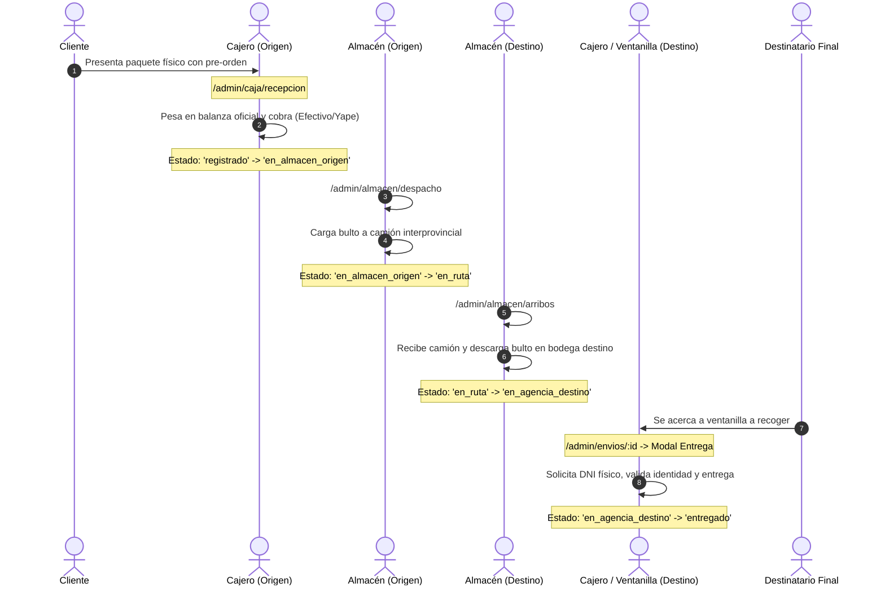

# Matriz de Roles, Permisos y Flujos de Trabajo en Frontend

Este documento detalla la visibilidad de módulos, comportamiento reactivo del Dashboard y los flujos operativos en la interfaz de usuario de **CargaExpressFront** según el rol del colaborador autenticado mediante JWT.

---

## 1. Matriz de Visibilidad de Módulos en el Menú Lateral (`AdminLayout.jsx`)

El menú de navegación lateral filtra de forma reactiva los enlaces según el atributo `user.rol` o `user.tipo`:

| Módulo / Menú | Ruta | Administrador | Cajero | Almacén | Courier |
| :--- | :--- | :---: | :---: | :---: | :---: |
| **Dashboard** | `/admin/dashboard` | ✅ Completo | ✅ Operativo | ✅ Logístico | ✅ Entregas |
| **Mis Envíos** | `/admin/envios` | ✅ Ver todo | ✅ Ver todo | ✅ Ver todo | ✅ Ver asignados |
| **Ficha de Envío** | `/admin/envios/:id` | ✅ Ver / Editar | ✅ Ver / Entregar | ✅ Ver | ✅ Ver / Entregar |
| **Recepción en Balanza** | `/admin/caja/recepcion` | ✅ Acceso | ✅ **Principal** | ❌ Oculto | ❌ Oculto |
| **Caja y Turnos** | `/admin/caja` | ✅ Acceso | ✅ **Principal** | ❌ Oculto | ❌ Oculto |
| **Despacho a Ruta** | `/admin/almacen/despacho` | ✅ Acceso | ❌ Oculto | ✅ **Principal** | ❌ Oculto |
| **Arribos (Descarga)** | `/admin/almacen/arribos` | ✅ Acceso | ❌ Oculto | ✅ **Principal** | ❌ Oculto |
| **Stock de Bodega** | `/admin/almacen` | ✅ Acceso | ❌ Oculto | ✅ Acceso | ❌ Oculto |
| **Directorio de Clientes** | `/admin/clientes` | ✅ Acceso | ✅ Acceso | ❌ Oculto | ❌ Oculto |
| **Catálogo de Agencias** | `/admin/agencias` | ✅ Acceso | ✅ Acceso | ✅ Acceso | ✅ Acceso |
| **Gestión de Personal (RBAC)**| `/admin/usuarios` | ✅ **Exclusivo** | ❌ Oculto | ❌ Oculto | ❌ Oculto |
| **Guías de Remisión** | `/admin/guias` | ✅ Acceso | ❌ Oculto | ✅ Acceso | ❌ Oculto |
| **Manifiestos de Carga** | `/admin/manifiestos` | ✅ Acceso | ❌ Oculto | ✅ Acceso | ❌ Oculto |
| **Courier y Repartos** | `/admin/courier` | ✅ Acceso | ❌ Oculto | ❌ Oculto | ✅ **Principal** |

---

## 2. Personalización Dinámica del Dashboard (`Dashboard.jsx`)

La pantalla de inicio del panel administrativo adapta sus indicadores clave (KPIs) y botones de acción rápida para proteger información financiera y optimizar el trabajo del operador:

### A. Perfil: Administrador / Cajero
- **Saludo:** *"Bienvenido, [Nombre] (ADMINISTRADOR / CAJERO)"*.
- **Métricas Visibles:**
  - `Envíos Totales` (Histórico de la empresa).
  - `Envíos Hoy` (Nuevas admisiones del día).
  - `Ingresos Hoy` (Total recaudado en Soles S/).
  - `Pendientes de Pago` (Envíos por cobrar en mostrador).
- **Acciones Rápidas:**
  - `+ Nueva Admisión (Balanza)` ➔ Dirige a `/admin/caja/recepcion`.
  - `Gestionar Personal` ➔ Dirige a `/admin/usuarios` (solo Admin).
  - `Directorio Clientes` ➔ Dirige a `/admin/clientes`.

### B. Perfil: Almacén / Logística
- **Saludo:** *"Bienvenido, [Nombre] (ALMACEN)"*.
- **Métricas Visibles (Finanzas ocultas por mínimo privilegio):**
  - `Envíos Totales` (Carga general registrada).
  - `Envíos Hoy` (Bultos que ingresaron a bodega hoy).
  - `Pendientes Despacho` (Paquetes en almacén origen listos para camión).
  - `En Tránsito a Sede` (Camiones en viaje hacia esta agencia).
- **Acciones Rápidas:**
  - `🚛 Despachar a Ruta` ➔ Dirige a `/admin/almacen/despacho`.
  - `📥 Recepcionar Camión (Arribo)` ➔ Dirige a `/admin/almacen/arribos`.
  - `📦 Ver Stock de Bodega` ➔ Dirige a `/admin/almacen`.

---

## 3. Cadena Operativa E2E en Pantallas (Ciclo de Vida)

---

## 4. Modal de Entrega Final al Destinatario (`EnvioDetalle.jsx`)

En la vista de detalle del envío (`/admin/envios/:id`):
1. **Condición de Aparición:** Si el paquete está en estado `en_agencia_destino` (o `en_reparto`), se muestra un botón destacado verde:
   `[ ✓ Entregar al Destinatario ]`.
2. **Formulario Modal de Seguridad:**
   - **DNI de quien recoge físicamente:** Validación obligatoria de 8 a 15 dígitos.
   - **Nombres y Apellidos:** Nombre completo de la persona que se presenta en ventanilla.
   - **Parentesco / Relación:** *Titular*, *Familiar con Carta Poder*, *Apoderado Legal*, *Compañero de Trabajo*.
   - **Observaciones:** Registro del estado del paquete al ser recibido.
3. **Persistencia:** Al confirmar, invoca `POST /api/v1/envios/{codigo}/entregar`, actualiza la fecha de entrega real, añade el hito en el historial y bloquea el botón para evitar duplicados.
